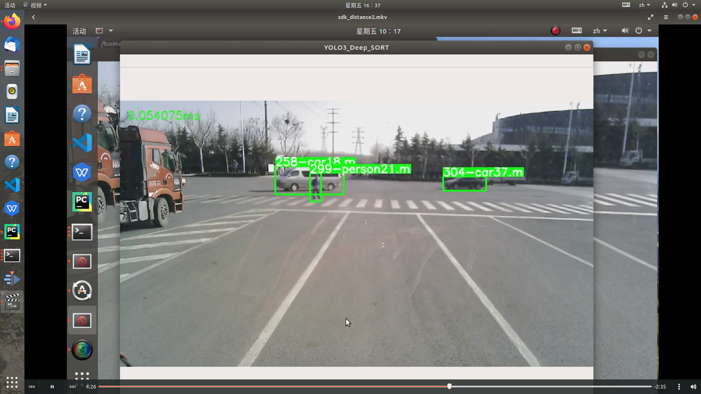
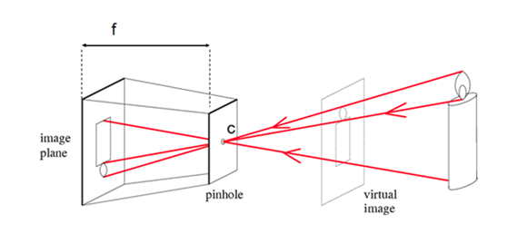
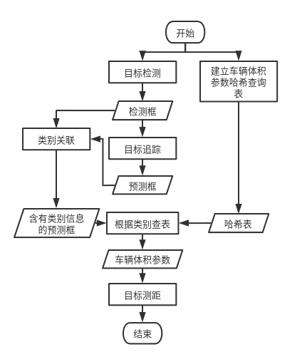

#  单目相机追踪测距程序介绍

### 1. 概述

本程序实现了单目相机多目标追踪和测距，主要包含以下三部分算法：

- [目标检测 (YOLO v3)](#1)
- [目标追踪 (deepsort)](#2)
- [单目测距 (小孔成像原理)](#3)

### 2. 依赖环境及包版本

Python version:  3

Packages:

- tensorflow == 1.14.0 
- opencv-python==4.4.0.42
- CUDA 9.0
- ...(其他包版本详见`requirements.txt`)

### 3. 运行程序

- 将`demo2_ME_distance.py `中 `args `字典中` input `的值设置为本机测试视频的路径
- 执行以下命令：

```shell
python demo2_ME_distance.py
```

程序运行成功示例截图：



### 4. `demo2_ME_distance.py`相关代码介绍

<span id="1"></span>

- 目标检测(YOLO v3)
```
args = {
    'input': '/home/cvgroup/yhl/test_video/test4.mp4',
    # 'input': r"https://stream7.iqilu.com/10339/upload_transcode/202002/18/20200218114723HDu3hhxqIT.mp4",
    'class': 'person',
    'anchor_path': './YOLOv3/data/yolo_anchors.txt',
    'new_size[0]': 416,
    'new_size[1]': 416,
    'letterbox_resize': True,
    'class_name_path': './YOLOv3/data/coco.names',
    'restore_path': './YOLOv3/data/darknet_weights/yolov3.ckpt',
    'save_video': False,
    'anchors': '',
    'classes': '',
    'num_class': ''
}

args['anchors'] = parse_anchors(args['anchor_path'])
args['classes'] = read_class_names(args['class_name_path'])
args['num_class'] = len(args['classes'])

```
重要参数介绍： 

`input`: 测试视频路径

`anchor_path`: yolov3 anchor box尺寸设置文件路径

`new_size[0]`、`new_size[1]`: yolov3网络输入图像尺寸的宽、高，即原始图像resize之后的图像尺寸

`letterbox_resize`： 是否设置letterbox_resize，若为True，则保持原始图像长宽比例，剩余部分用灰色填充

`class_name_path`: yolov3识别物体的种类，共20类

`restore_path`: yolov3权重文件路径

!!其他参数字段在不影响程序运行的情况下可以删掉

程序以帧为单位对测试视频进行处理，每帧图像经过预处理后输入到yolov3网络中进行目标检测，yolov3的输出包括每帧图像中bounding box的坐标，以及每个bounding box所对应的目标种类和置信度。输出代码如下:
```
        boxes_, scores_, labels_ = sess.run([boxes0, scores0, labels0], feed_dict={input_data: img})

```

<span id="2"></span>
- 目标追踪(deepsort)

相关参考资料：

[多目标跟踪：SORT和Deep SORT](https://zhuanlan.zhihu.com/p/59148865)

[关于 Deep Sort 的一些理解](https://zhuanlan.zhihu.com/p/80764724)

为实现多目标跟踪，第一步根据运动模型建立卡尔曼滤波，对上一步yolov3输出的检测框进行预测；第二步使用匈牙利算法对预测框和检测框进行id匹配，从而实现两框之间的关联。

为了更好的实现跟踪，避免出现反复的id跳变，deepsort在sort的基础上做了一定的改进，增加了级联匹配方式和马氏距离和余弦距离的计算（这两个距离与物体的运动和外观信息相关）。外观信息特征的获取则是利用了reID模块，即一个小型的卷积神经网络。该网络同样可以自行训练，用来实现行人重识别或车辆重识别功能。

deepsort相关参数介绍：

```
max_cosine_distance = 0.5  # 余弦距离的控制阈值re
model_filename = './model_data/market1501.pb'
encoder = gdet.create_box_encoder(model_filename, batch_size=1)
metric = nn_matching.NearestNeighborDistanceMetric("cosine", max_cosine_distance, nn_budget)
tracker = Tracker(metric)
```

`max_cosine_distance` 的作用参考级联匹配流程图，影响了预测框与检测框的匹配效果

`model_filename` 车辆重识别的权重文件位置

`encoder` 建立框编码器，即建立车辆重识别特征提取器

`metric` 建立的距离模型

`tracker` 建立的追踪器，用来实现追踪，关于卡尔曼滤波和匈牙利算法的具体实现以及deepsort算法的输出可参考`track`类的实现

目标追踪模块同样是以帧为处理单位，输入为上一步yolov3的输出（检测框的坐标，检测框内物体的表观特征），输出为预测框的坐标和给框匹配的id。相关代码如下：

```
features = encoder(frame, boxs)
detections = [Detection(bbox, 1.0, feature, cls) for bbox, feature, cls in zip(boxs, features, class_names)]

# Call the tracker
tracker.predict()
tracker.update(detections)
```

<span id="3"></span>
- 单目相机测距

该部分代码实现了单目相机多目标的测距功能。单目相机测距不同于双目测距，单目没有深度信息，不能做到像素级的距离测量。单目测距需要通过外加先验知识，通过图像中物体的尺寸和其实际尺寸，利用小孔成像原理来大致估算物体到摄像头的距离。

小孔成像原理示意图：



假设蜡烛在图像中的宽为w，实际宽度为W；相机的焦距为f，蜡烛距离相机的距离为d，则根据相似三角形原理满足以下关系：

W / w = d / f    即    d = W * f / w

要得到w，不但要知道蜡烛宽度在图像中所占的像素点长度，还应知道相机成像中，每个像素点所代表的实际宽度。这个宽度与相机光圈CCD的尺寸相关。

在第一步和第二步程序中，本文处理结果均为多目标，因此，为了实现对多目标的测距功能，本程序建立了哈希表，对路上常见的目标的长、宽、高进行了大致的估计和统计。同时，对预测框与检测框的位置进行比较，从而获取预测框的类别信息，根据类别信息进行查表，得到物体的实际尺寸估计，最后实现多目标的测距。


建立哈希表：

```
vehivle = {
    'car': [1.8, 1.5],
    'person': [0.5, 1.7],
    'bus': [2.5, 3],
    'truck': [2.5, 2.8],
    'bicycle': [0.4, 1.5]
}
```

测距代码详见`dis_and_vel.py`中的`mdm_info_proc`函数。

类别关联部分如下：

```
            for det in detections:
                det_box = det.to_still()
                cls = det.to_cls()
                det_box_x, det_box_y = float((det_box[0] + det_box[2]) / 2), float((det_box[1] + det_box[3]) / 2)
                if abs(bbox_x - det_box_x) < 5 or abs(bbox_y - det_box_y) < 5:
                    track.current_distance = dis_and_vel.mdm_info_proc(det_box, time.time(), t1, w, h, vehivle[cls][0], vehivle[cls][1])
                    if track.last_distance != 0:
                        track.velocity = dis_and_vel.cal_velocity(track.current_distance, track.last_distance,
                                                                  time.time() - t1)
                        track.last_distance = track.current_distance
                    else:
                        track.velocity = 0
                        track.last_distance = track.current_distance

                    plot_one_box_l(frame, [int(det_box[0]), int(det_box[1]), int(det_box[2]), int(det_box[3])],
                                   label=cls+str(track.current_distance)[:3] + 'm',
                                   color=(0, 255, 0))
                    break
```


- 算法整体逻辑图：




### 5.其他

关于yolov3和deepsort中reID模块的训练参考各自的`readme.md`

